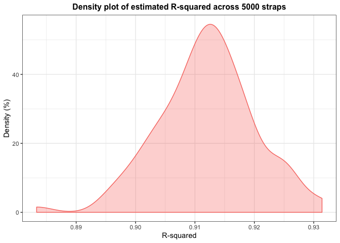
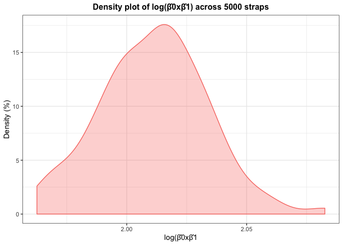

P8105 – Homework 6
================
Ngoc Duong - nqd2000
11/23/2019

### Problem 2

``` r
#Download the data 
weather_df = 
  rnoaa::meteo_pull_monitors(
    c("USW00094728"),
    var = c("PRCP", "TMIN", "TMAX"), 
    date_min = "2017-01-01",
    date_max = "2017-12-31") %>%
  mutate(
    name = recode(id, USW00094728 = "CentralPark_NY"),
    tmin = tmin / 10,
    tmax = tmax / 10) %>%
  select(name, id, everything())
```

    ## Registered S3 method overwritten by 'crul':
    ##   method                 from
    ##   as.character.form_file httr

    ## Registered S3 method overwritten by 'hoardr':
    ##   method           from
    ##   print.cache_info httr

    ## file path:          /Users/User/Library/Caches/rnoaa/ghcnd/USW00094728.dly

    ## file last updated:  2019-09-05 00:08:38

    ## file min/max dates: 1869-01-01 / 2019-09-30

``` r
#getting r-square
weather_df %>% 
lm(tmax ~ tmin, data = .) %>% 
  broom::glance() %>% 
  .[,1]
```

    ## # A tibble: 1 x 1
    ##   r.squared
    ##       <dbl>
    ## 1     0.912

``` r
# calculate log(beta0 * beta1)
weather_df %>% 
lm(tmax ~ tmin, data = .) %>% 
  broom::tidy() %>% 
  select(term, estimate) %>% 
  pivot_wider(.,
              names_from = term, 
              values_from = estimate) %>% 
  janitor::clean_names() %>% 
  mutate(log_beta_prod = log(intercept * tmin, base = exp(1))) %>% 
  .[,3]
```

    ## # A tibble: 1 x 1
    ##   log_beta_prod
    ##           <dbl>
    ## 1          2.01

``` r
#function returns needed values 
mystats = function(lm){
  mystats = cbind(
  lm %>% 
    broom::glance() %>% 
  .[,1],
  lm %>% 
  broom::tidy() %>% 
  select(term, estimate) %>% 
  pivot_wider(.,
              names_from = term, 
              values_from = estimate) %>% 
  janitor::clean_names() %>% 
  mutate(log_beta_prod = log(intercept * tmin, base = exp(1))) %>% 
  .[,3])
 mystats
}
```

``` r
set.seed(7)
# use R built in function modelr to obtain results and plot estimates
weather_stats = 
  weather_df %>% 
  modelr::bootstrap(n = 100) %>% 
  mutate(models = 
           map(strap, ~lm(tmax ~ tmin, data = .x)),
         results = 
           map(models, mystats)) %>% 
  select(-strap,-models) %>% 
  unnest(results)

#start to plot R-squared 
weather_stats %>% 
  ggplot(aes(x = r.squared, 
             fill = "#0000ff", 
             color = "#0000ff")) +                  #plot R-squared's
  geom_density(alpha = 0.3) +
  labs(title = "Density plot of estimated R-squared across 5000 straps",
       y = "Density (%)",
       x = "R-squared") +                           #add graph and axis title
  theme_bw() + 
  theme(plot.title = 
          element_text(hjust = 0.5, 
                       size=12, 
                       face='bold'), 
        legend.position = "none")                #customize annotations
```

<!-- -->

``` r
#plot density of log(betas' product)
weather_stats %>% 
  ggplot(aes(x = log_beta_prod, 
             fill = "green", 
             color = "green")) +                  #plot density of log_beta_prod
  geom_density(alpha = 0.3) +
  labs(title = "Density plot of log(β̂0xβ̂1) across 5000 straps",
       y = "Density (%)",
       x = "log(β̂0xβ̂1") +                           #add graph and axis title
  theme_bw() + 
  theme(plot.title = 
          element_text(hjust = 0.5, 
                       size=12, 
                       face='bold'), 
        legend.position = "none")  
```

<!-- -->
