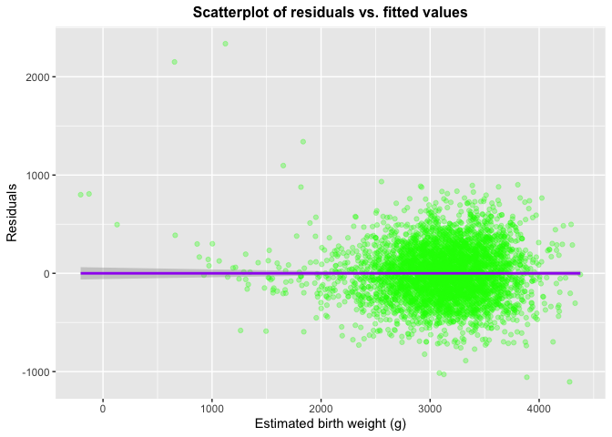
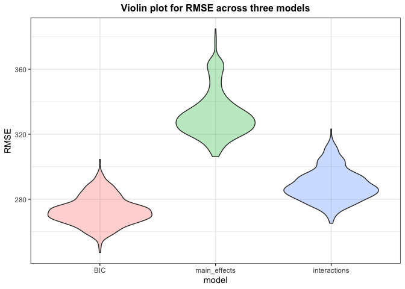
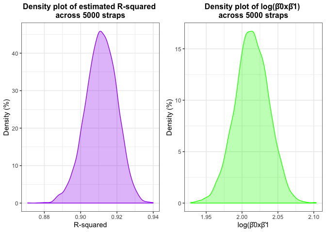

P8105 – Homework 6
================
Ngoc Duong - nqd2000
11/23/2019

### Problem 1

``` r
#load data 
bw_data = read_csv("./data/birthweight.csv") %>% 
  janitor::clean_names() %>% 
  mutate(babysex = factor(babysex),                     #change data type of certain variables appropriately
         frace = factor(frace),
         malform = factor(malform),
         mrace = factor(mrace)) %>%              
  select(pnumlbw, pnumsga, parity, bwt,everything())    #rearrange variables to easily select without unneccessary variables later on
```

    ## Parsed with column specification:
    ## cols(
    ##   .default = col_double()
    ## )

    ## See spec(...) for full column specifications.

``` r
#this code indicates there's no NA's in this dataset
sum(is.na(bw_data))
```

    ## [1] 0

I used `str(bw_data)` to check the data type of each variable, and
transformed `babysex`, `frace`, `mrace`, and `malform` into factors (as
suggested by the variable descriptions). I then checked NA’s by using
`sum(is.na(bw_data))`, which gives 0. This suggests there’s no NA
values. Additionally, I used `summary(bw_data)` to look at potential
outliers, or suspicious values. I found entire columns of `pnumsga`,
`pnumlbw`, and `parity` to be always 0, which suggests they probably
won’t contribute to the model. Thus I leave them out when building
regression models (by selecting only subset of `bw_data` without them).

Now I try to propose a regression model with birth weight as the outcome
variable: First, I want to make a correlation plot to look at the
relationship between the independent and dependent variables…

``` r
bw_data[,4:20] %>%
Filter(is.numeric,.) %>%              #filter only numeric variables 
  cor() %>%                           #compute correlation matrix
  corrplot(method = "circle",         #represent correlation in "circle", size = magnitude 
           type = "upper", 
           diag=FALSE)
```

<!-- -->

Variables that `bwt` appears to be moderately and highly correlated with
include: `bhead`, `blength`, `gaweeks`, and `delwt`, while `deltwt` also
appears to be correlated with `ppbmi` and `ppwt` (which are also highly
correlated as they were both constructed based on mother’s pre-pregnancy
weight). Other than that, `bheard` and `blength` are correlated because
they both reflect the size of the infants (in different aspects).

Therefore, from what I’ve seen above, some of the variables I want to
include are `bhead`, `blength`, `gaweeks`, `delwt`, and `ppbmi` (since
`ppbmi` and `ppwt` are highly correlated, including both might cause the
problem of multicollinearity, so I picked `ppwt` (since it seems to be a
little more associated with infant’s weight). Other categorical
variables not covered by the correlation plot that I assume (through
appropriate reasoning) are related to the outcome variable are:
`babysex` and mother’s race `mrace` (or `frace`).

``` r
#fit the linear regression (with only main effects)
bw_fit_base = lm(bwt ~ bhead + blength + gaweeks + delwt + ppbmi + mrace + babysex, 
                 data = bw_data) 

#look at R-squared and adjusted R-squared
bw_fit_base %>% 
  broom::glance() %>% 
  .[,1:2] %>% 
  knitr::kable()
```

| r.squared | adj.r.squared |
| --------: | ------------: |
|  0.712723 |     0.7121262 |

This model has an adjusted r-squared of 71.2%, which is decent.

We should probably also check for multicollinearity (for potential
interpretation purpose, although this wouldn’t affect R-squared value).

``` r
car::vif(bw_fit_base)
```

    ##             GVIF Df GVIF^(1/(2*Df))
    ## bhead   1.812840  1        1.346418
    ## blength 1.752912  1        1.323976
    ## gaweeks 1.228993  1        1.108600
    ## delwt   2.314933  1        1.521491
    ## ppbmi   2.170605  1        1.473297
    ## mrace   1.119799  3        1.019037
    ## babysex 1.041151  1        1.020368

No VIF values were above 5, so we don’t need to worry about (severe)
multicollinearity.

We can also attempt to use stepwise regression to come up with a model
based on BIC criterion

This is the final model suggested by backward stepwise
regression:

``` r
reg_bic = lm(formula = bwt ~ babysex + bhead + blength + delwt + gaweeks + mheight + mrace + ppwt + smoken, data = bw_data) 
```

Below is an overview of the variables, their estimates, se, t-stat, and
p-values

``` r
reg_bic %>% broom::tidy() %>%  
  knitr::kable()
```

| term        |      estimate |   std.error |   statistic |   p.value |
| :---------- | ------------: | ----------: | ----------: | --------: |
| (Intercept) | \-6090.640959 | 137.5627901 | \-44.275352 | 0.0000000 |
| babysex2    |     28.927218 |   8.4576787 |    3.420231 | 0.0006315 |
| bhead       |    131.174549 |   3.4460335 |   38.065373 | 0.0000000 |
| blength     |     74.728511 |   2.0186820 |   37.018465 | 0.0000000 |
| delwt       |      4.105313 |   0.3920650 |   10.471002 | 0.0000000 |
| gaweeks     |     11.408645 |   1.4579351 |    7.825208 | 0.0000000 |
| mheight     |      6.813279 |   1.7803370 |    3.826960 | 0.0001316 |
| mrace2      |  \-145.495954 |   9.2303009 | \-15.762861 | 0.0000000 |
| mrace3      |   \-78.168678 |  42.3138236 |  \-1.847356 | 0.0647638 |
| mrace4      |  \-106.537047 |  19.1168869 |  \-5.572929 | 0.0000000 |
| ppwt        |    \-2.672565 |   0.4273757 |  \-6.253433 | 0.0000000 |
| smoken      |    \-4.878211 |   0.5857973 |  \-8.327474 | 0.0000000 |

``` r
#obtain necessary statistics for this model
reg_bic %>% 
  broom::glance() %>% 
  .[,1:2] %>% 
  knitr::kable()
```

| r.squared | adj.r.squared |
| --------: | ------------: |
|  0.717524 |     0.7168063 |

Adjusted r-squared obtained from this model is 71.7%, which is slightly
better than the previously proposed model.

Checking for multicollinearity:

``` r
vif(reg_bic)
```

    ##             GVIF Df GVIF^(1/(2*Df))
    ## babysex 1.044543  1        1.022029
    ## bhead   1.822575  1        1.350028
    ## blength 1.766301  1        1.329023
    ## delwt   4.430296  1        2.104827
    ## gaweeks 1.236098  1        1.111799
    ## mheight 1.307114  1        1.143291
    ## mrace   1.244184  3        1.037084
    ## ppwt    4.338706  1        2.082956
    ## smoken  1.100396  1        1.048997

No values were greater than 5, so we don’t need to worry about
multicollinearity issue.

We can also see that the original proposed model happens to be nested
within this model (as suggested by stepwise regression), we can use
partial F-test to test which model is “superior”.

``` r
#partial F-test
anova(bw_fit_base, reg_bic)
```

    ## Analysis of Variance Table
    ## 
    ## Model 1: bwt ~ bhead + blength + gaweeks + delwt + ppbmi + mrace + babysex
    ## Model 2: bwt ~ babysex + bhead + blength + delwt + gaweeks + mheight + 
    ##     mrace + ppwt + smoken
    ##   Res.Df       RSS Df Sum of Sq      F    Pr(>F)    
    ## 1   4332 327108543                                  
    ## 2   4330 321641969  2   5466573 36.796 < 2.2e-16 ***
    ## ---
    ## Signif. codes:  0 '***' 0.001 '**' 0.01 '*' 0.05 '.' 0.1 ' ' 1

Since the p-value reported by the partial F-test is very small
(\<2.2e-16), we can conclude that model 2 (expanded model suggested by
stepwise regression) is “superior”.

Check model assumption by plotting residuals vs. fitted values

``` r
bw_data %>% 
  add_residuals(reg_bic) %>%             # add residuals using model, output as col in tibble
  add_predictions(reg_bic) %>%           # add predictions using model
  ggplot(aes(x = pred, y = resid)) +     #specify plotting residuals against fitted values
  geom_point(alpha = 0.3,                #scatterplot
             color = "green") +
  geom_smooth(method = "lm",             #draw a line through the residuals 
              color = "purple") +
  labs(title = "Scatterplot of residuals vs. fitted values",  #annotate plot
       x = "Estimated birth weight (g)",
       y = "Residuals") + 
  theme(plot.title =     
          element_text(hjust = 0.5, size=12, face='bold'))
```

<!-- -->

Except for a few outliers observed towards the lower tail, overall, we
can see that:

1)  The residuals spread randomly around the 0 line, indicating
    residuals have linear patterns, thus the relationships between the
    independent and dependent variables should be linear.

2)  The residuals form a consistent band (across values of fitte values)
    around the 0 line indicating homoskedasticity (homogeneity of error
    variance).

After that, we run the two models suggested by the problem and obtain
information about the models’ fit below:

The first model using length at birth and gestational age as predictors
(main effects only)

``` r
#regress bwt on the given preodictors
fit_main = lm(bwt ~ blength + gaweeks, data = bw_data) 

#obtain information about model's fit
fit_main %>% 
  broom::glance() %>%
  .[,1:2] %>% 
  knitr::kable()
```

| r.squared | adj.r.squared |
| --------: | ------------: |
| 0.5768894 |     0.5766943 |

The second model using head circumference, length, sex, and all
interactions (including the three-way interaction) between
these

``` r
#regress bwt on the given predictors, including all possbible interactions
fit_int = lm(bwt ~ bhead*blength*babysex, data = bw_data)

#obtain information about model's fit
fit_int %>% 
  broom::glance() %>%
  .[,1:2] %>% 
  knitr::kable()
```

| r.squared | adj.r.squared |
| --------: | ------------: |
|  0.684876 |      0.684367 |

Make this comparison in terms of the cross-validated prediction
error

``` r
cv_df =                          #split into train/test 500 times, and stores using list column
  crossv_mc(bw_data, 500) %>% 
  mutate(                        #transform list into tibbles
    train = map(train, as_tibble),
    test = map(test, as_tibble)) %>% 
#"map" model fitting to each train dataset for all 3 models
  mutate(fit_bic = map(train, ~lm(bwt ~ babysex + bhead + blength + delwt + gaweeks + mheight + mrace + ppwt + smoken, data = .x)),
         fit_main = map(train, ~lm(bwt ~ blength + gaweeks, data = .x)),
         fit_int  = map(train, ~lm(bwt ~ bhead*blength*babysex, data = .x))) %>% 
#"map" rmse using model created by train data and and apply on test data to get rmse
  mutate(rmse_BIC = map2_dbl(fit_bic, test, ~rmse(model = .x, data = .y)),
         rmse_main_effects = map2_dbl(fit_main, test, ~rmse(model = .x, data = .y)),
         rmse_interactions = map2_dbl(fit_int, test, ~rmse(model = .x, data = .y)))

#plot rmse distribution by each model
cv_df %>% 
  select(starts_with("rmse")) %>%   #select rmse column
  pivot_longer(                     #transform to long tibble to easily specify group when plot
    everything(),
    names_to = "model", 
    values_to = "rmse",
    names_prefix = "rmse_") %>% 
  mutate(model = fct_inorder(model)) %>% 
  ggplot(aes(x = model, y = rmse, fill = model)) + #specify elements going into the plots
  geom_violin(alpha = 0.3) + 
  labs(title = "Violin plot for RMSE across three models", #annotate and modify plots
       y = "RMSE") + 
  theme_bw() + 
  theme(legend.position = "none",
        plot.title =     
          element_text(hjust = 0.5, size=12, face='bold'))
```

<!-- -->

Comment: Looking at the plot above, we can see that the RMSE for the
model suggested by stepwise regression (criterion BIC) is the lowest.
Therefore, we can pick for prediction purpose the proposed model –
including `babysex`, `bhead`, `blength`, `delwt`, `gaweeks`, `mheight`,
`mrace`, `ppwt` and `smoken` (main effects).

### Problem 2

``` r
#Download the data 
weather_df = 
  rnoaa::meteo_pull_monitors(
    c("USW00094728"),
    var = c("PRCP", "TMIN", "TMAX"), 
    date_min = "2017-01-01",
    date_max = "2017-12-31") %>%
  mutate(
    name = dplyr::recode(id, USW00094728 = "CentralPark_NY"),
    tmin = tmin / 10,
    tmax = tmax / 10) %>%
  select(name, id, everything())
```

We can write a function that returns the values the question is
specifically asking for:

``` r
mystats = function(lm){
  mystats = cbind(             #function binds two values together
  lm %>%                       #first value is r-squared obtained from broom::glance(lm)
    broom::glance() %>% 
  .[,1],
  lm %>%                       #second value
  broom::tidy() %>% 
  select(term, estimate) %>%   #want to get name of var (include y-intercept) and its estimates
  pivot_wider(.,               #pivot_wider to easily multiply column
              names_from = term, 
              values_from = estimate) %>% 
  janitor::clean_names() %>% 
  mutate(log_beta_prod =       #needed value log of product of betas = intercept * tmin
           log(intercept * tmin, #use base = e, assuming log here is natural log
               base = exp(1))) %>% 
  .[,3])                       #extract the specific log of product of betas value
 mystats                       #return mystats dataframe
}
```

Use 5000 bootstrap samples and produce estimates of r-squared and log
for each strap log(β̂0\*β̂1) and plot the distribution of estimates

``` r
set.seed(7)
# use R built-in function modelr to obtain results and plot estimates
weather_stats = 
  weather_df %>% 
  modelr::bootstrap(n = 5000) %>%    #create a bootstrap of 5000 straps
  mutate(models =                   #"map" lm function to each strap, documented in models list
           map(strap, ~lm(tmax ~ tmin, data = .x)),
         results =                  #"map" mystats function to each model to obtain statistics
           map(models, mystats)) %>% 
  select(-strap,-models) %>%        #deselect unnecessary strap and models
  unnest(results)                   #unnest results

#start to plot R-squared 
r_sqr = weather_stats %>% 
  ggplot(aes(x = r.squared)) +      #plot R-squared's
  geom_density(alpha = 0.3, 
               fill = "purple", 
               color = "purple") +
  labs(title = "Density plot of estimated R-squared \nacross 5000 straps",
       y = "Density (%)",
       x = "R-squared") +                           #add graph and axis title
  theme_bw() + 
  theme(plot.title = 
          element_text(hjust = 0.5, 
                       size=12, 
                       face='bold'), 
        legend.position = "none")                   #customize annotations
         
#plot density of log(betas' product)
log_est = weather_stats %>% 
  ggplot(aes(x = log_beta_prod)) +                  #plot density of log_beta_prod
  geom_density(alpha = 0.3, 
               fill = "green", 
               color = "green") +
  labs(title = "Density plot of log(β̂0xβ̂1) \nacross 5000 straps",
       y = "Density (%)",
       x = "log(β̂0xβ̂1") +                           #add graph and axis title
  theme_bw() + 
  theme(plot.title = 
          element_text(hjust = 0.5, 
                       size=12, 
                       face='bold'), 
        legend.position = "none")  

#patch plots together
r_sqr + log_est
```

<!-- -->

Comment: We can see that both the R-squared and log(beta0 \* beta1) are
both normally distributed, athough the boostrap distribution of
R-squared shows a little skewness in the lower tail.

We can get 95% CI for R-squared and log(β̂0xβ̂1)

``` r
weather_stats %>%
  pull(r.squared) %>%        #pull needed column (r-squared)
  as.vector() %>%            #turn into vector
  quantile(c(0.025, 0.975))  #obtain 2.5th and 97.5th quantile
```

    ##      2.5%     97.5% 
    ## 0.8935215 0.9272975

``` r
#repeat the same procedure as above
weather_stats %>%  
  pull(log_beta_prod) %>%    
  as.vector() %>%            
  quantile(c(0.025, 0.975))  
```

    ##     2.5%    97.5% 
    ## 1.966424 2.058961

As seen above, the 95% CI for adjusted R-squared is \[0.894, 0.927\] and
for ln(β̂1\*β̂0) is \[1.966, 2.059\].
