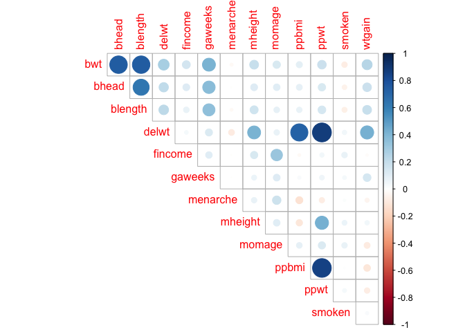
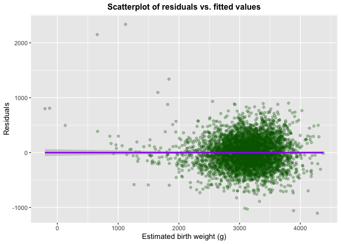
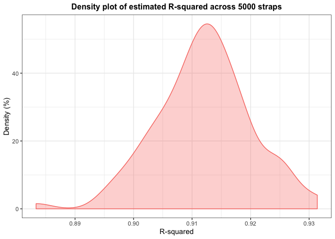

P8105 – Homework 6
================
Ngoc Duong - nqd2000
11/23/2019

### Problem 1

``` r
bw_data = read_csv("./data/birthweight.csv") %>% 
  janitor::clean_names() %>% 
  mutate(babysex = factor(babysex),
         frace = factor(frace),
         malform = factor(malform),
         mrace = factor(mrace)) %>% 
  select(pnumlbw, pnumsga, parity, bwt,everything())
```

    ## Parsed with column specification:
    ## cols(
    ##   .default = col_double()
    ## )

    ## See spec(...) for full column specifications.

``` r
sum(is.na(bw_data))
```

    ## [1] 0

I used `str(bw_data)` to check the data type of each variable, and
`summary(bw_data)` to check if there’s any outliers and NA’s. Summary
statistics suggested there didn’t seem to be any NA’s (another quick way
to check NA’s could be `sum(is.na(bw_data))` = 0 which gave the same
conclusion). Additionally, since `pnumsga`, `pnumlbw`, and `parity`
values are always 0, they probably won’t contribute to the model and
thus I’ll leave them out when building regression models (by selecting
only subset of `bw_data` without them).

Now I try to propose a regression model with birth weight as the outcome
variable

``` r
#make a correlation plot to look at the relationship between the independent and dependent variables
bw_data[,4:20] %>%
Filter(is.numeric,.) %>% 
  cor() %>%   
  corrplot(method = "circle", type = "upper", diag=FALSE)
```

<!-- -->
Variables that `bwt` appears to be moderately and highly correlated with
include: `bhead`, `blength`, `gaweeks`, and `delwt`, while `deltwt` also
appears to be correlated with `ppbmi` and `ppwt` (which are also highly
correlated as they were both constructed based on mother’s pre-pregnancy
weight). Other than that, `bheard` and `blength` are correlated because
they both reflect the size of the infants (in different aspects).

Therefore, from what I’ve seen above, some of the variables I want to
include are `bhead`, `blength`, `gaweeks`, `delwt`, and `ppbmi` (since
`ppbmi` and `ppwt` are highly correlated, including both might cause the
problem of multicollinearity, so I picked `ppwt` (since it seems to be a
little more associated with infant’s weight). Other categorical
variables not covered by the correlation plot that I think (through
appropriate reasoning) are related to the outcome variable are:
`babysex` and mother’s race `mrace` (or
`frace`).

``` r
bw_fit_base = lm(bwt ~ bhead + blength + gaweeks + delwt + ppbmi + mrace + babysex, 
                 data = bw_data) 
bw_fit_base %>% 
  broom::glance() %>% 
  .[,1:2]
```

    ## # A tibble: 1 x 2
    ##   r.squared adj.r.squared
    ##       <dbl>         <dbl>
    ## 1     0.713         0.712

This model has an adjusted r-squared of 71.2%, which seems decent.

We should probably also check for multicollinearity (for interpretation
purpose, although this wouldn’t affect R-squared value)

``` r
vif(bw_fit_base)
```

    ##             GVIF Df GVIF^(1/(2*Df))
    ## bhead   1.812840  1        1.346418
    ## blength 1.752912  1        1.323976
    ## gaweeks 1.228993  1        1.108600
    ## delwt   2.314933  1        1.521491
    ## ppbmi   2.170605  1        1.473297
    ## mrace   1.119799  3        1.019037
    ## babysex 1.041151  1        1.020368

No VIF values were above 5, so we don’t need to worry about
multicollinearity problem.

We can also attempt to use stepwise regression to come up with a model
based on BIC criterion

``` r
#This is the final model suggested by backward stepwise regression
reg_bic = lm(formula = bwt ~ babysex + bhead + blength + delwt + gaweeks + mheight + mrace + ppwt + smoken, data = bw_data)
```

``` r
#obtain necessary statistics for this model
reg_bic %>% 
  broom::glance() %>% 
  .[,1:2]
```

    ## # A tibble: 1 x 2
    ##   r.squared adj.r.squared
    ##       <dbl>         <dbl>
    ## 1     0.718         0.717

Adjusted r-squared obtained from this model is 71.7%, which is slight
better than the previously proposed model.

Checking for multicollinearity:

``` r
vif(reg_bic)
```

    ##             GVIF Df GVIF^(1/(2*Df))
    ## babysex 1.044543  1        1.022029
    ## bhead   1.822575  1        1.350028
    ## blength 1.766301  1        1.329023
    ## delwt   4.430296  1        2.104827
    ## gaweeks 1.236098  1        1.111799
    ## mheight 1.307114  1        1.143291
    ## mrace   1.244184  3        1.037084
    ## ppwt    4.338706  1        2.082956
    ## smoken  1.100396  1        1.048997

No values were greater than 5, so we don’t need to worry about
multicollinearity issue.

We can also see that the original proposed model happens to be nested
within this model (as suggested by stepwise regression), we can use
partial F-test to test which model is “superior”.

``` r
anova(bw_fit_base, reg_bic)
```

    ## Analysis of Variance Table
    ## 
    ## Model 1: bwt ~ bhead + blength + gaweeks + delwt + ppbmi + mrace + babysex
    ## Model 2: bwt ~ babysex + bhead + blength + delwt + gaweeks + mheight + 
    ##     mrace + ppwt + smoken
    ##   Res.Df       RSS Df Sum of Sq      F    Pr(>F)    
    ## 1   4332 327108543                                  
    ## 2   4330 321641969  2   5466573 36.796 < 2.2e-16 ***
    ## ---
    ## Signif. codes:  0 '***' 0.001 '**' 0.01 '*' 0.05 '.' 0.1 ' ' 1

Since the p-value reported by the partial F-test is very small
(\<2.2e-16), we can conclude that model 2 (expanded model suggested by
stepwise regression) is “superior”.

Check model assumption (normality of residuals) by plotting resid
vs. fitted values

``` r
bw_data %>% 
  add_residuals(reg_bic) %>%                   # adding residuals to our df
  add_predictions(reg_bic) %>%                 # add predictions using our df
  ggplot(aes(x = pred, y = resid)) +
  geom_point(alpha = 0.3, color = "darkgreen") +
  geom_smooth(method = "lm", color = "purple") +
  labs(title = "Scatterplot of residuals vs. fitted values",
       x = "Estimated birth weight (g)",
       y = "Residuals") + 
  theme(plot.title =     
          element_text(hjust = 0.5, size=12, face='bold'))
```

<!-- -->

After that, we run the two models suggested by the
problem:

``` r
#using length at birth and gestational age as predictors (main effects only)
fit_main = lm(bwt ~ blength + gaweeks, data = bw_data) 
fit_main %>% 
  broom::glance()
```

    ## # A tibble: 1 x 11
    ##   r.squared adj.r.squared sigma statistic p.value    df  logLik    AIC
    ##       <dbl>         <dbl> <dbl>     <dbl>   <dbl> <int>   <dbl>  <dbl>
    ## 1     0.577         0.577  333.     2958.       0     3 -31381. 62771.
    ## # … with 3 more variables: BIC <dbl>, deviance <dbl>, df.residual <int>

``` r
#using head circumference, length, sex, and all interactions (including the three-way interaction) between these
fit_int = lm(bwt ~ bhead*blength*babysex, data = bw_data)
fit_int %>% 
  broom::glance()
```

    ## # A tibble: 1 x 11
    ##   r.squared adj.r.squared sigma statistic p.value    df  logLik    AIC
    ##       <dbl>         <dbl> <dbl>     <dbl>   <dbl> <int>   <dbl>  <dbl>
    ## 1     0.685         0.684  288.     1346.       0     8 -30742. 61501.
    ## # … with 3 more variables: BIC <dbl>, deviance <dbl>, df.residual <int>

Make this comparison in terms of the cross-validated prediction error;
use crossv\_mc and functions in purrr as appropriate.

### Problem 2

``` r
#Download the data 
weather_df = 
  rnoaa::meteo_pull_monitors(
    c("USW00094728"),
    var = c("PRCP", "TMIN", "TMAX"), 
    date_min = "2017-01-01",
    date_max = "2017-12-31") %>%
  mutate(
    name = dplyr::recode(id, USW00094728 = "CentralPark_NY"),
    tmin = tmin / 10,
    tmax = tmax / 10) %>%
  select(name, id, everything())
```

    ## Registered S3 method overwritten by 'crul':
    ##   method                 from
    ##   as.character.form_file httr

    ## Registered S3 method overwritten by 'hoardr':
    ##   method           from
    ##   print.cache_info httr

    ## file path:          /Users/User/Library/Caches/rnoaa/ghcnd/USW00094728.dly

    ## file last updated:  2019-09-05 00:08:38

    ## file min/max dates: 1869-01-01 / 2019-09-30

``` r
#function returns needed values 
mystats = function(lm){
  mystats = cbind(
  lm %>% 
    broom::glance() %>% 
  .[,1],
  lm %>% 
  broom::tidy() %>% 
  select(term, estimate) %>% 
  pivot_wider(.,
              names_from = term, 
              values_from = estimate) %>% 
  janitor::clean_names() %>% 
  mutate(log_beta_prod = log(intercept * tmin, base = exp(1))) %>% 
  .[,3])
 mystats
}
```

Obtain bootstraps

``` r
set.seed(7)
# use R built in function modelr to obtain results and plot estimates
weather_stats = 
  weather_df %>% 
  modelr::bootstrap(n = 100) %>% 
  mutate(models = 
           map(strap, ~lm(tmax ~ tmin, data = .x)),
         results = 
           map(models, mystats)) %>% 
  select(-strap,-models) %>% 
  unnest(results)

#start to plot R-squared 
weather_stats %>% 
  ggplot(aes(x = r.squared, 
             fill = "#0000ff", 
             color = "#0000ff")) +                  #plot R-squared's
  geom_density(alpha = 0.3) +
  labs(title = "Density plot of estimated R-squared across 5000 straps",
       y = "Density (%)",
       x = "R-squared") +                           #add graph and axis title
  theme_bw() + 
  theme(plot.title = 
          element_text(hjust = 0.5, 
                       size=12, 
                       face='bold'), 
        legend.position = "none")                #customize annotations
```

<!-- -->

``` r
#plot density of log(betas' product)
weather_stats %>% 
  ggplot(aes(x = log_beta_prod, 
             fill = "green", 
             color = "green")) +                  #plot density of log_beta_prod
  geom_density(alpha = 0.3) +
  labs(title = "Density plot of log(β̂0xβ̂1) across 5000 straps",
       y = "Density (%)",
       x = "log(β̂0xβ̂1") +                           #add graph and axis title
  theme_bw() + 
  theme(plot.title = 
          element_text(hjust = 0.5, 
                       size=12, 
                       face='bold'), 
        legend.position = "none")  
```

<!-- -->

We can get 95% CI for R-squared and
log(β̂0xβ̂1)

``` r
weather_stats %>% pull(r.squared) %>% as.vector() %>% quantile(c(0.25, 0.975))
```

    ##       25%     97.5% 
    ## 0.9073319 0.9266728

``` r
weather_stats %>% pull(log_beta_prod) %>% as.vector() %>% quantile(c(0.25, 0.975))
```

    ##      25%    97.5% 
    ## 1.997565 2.054918
